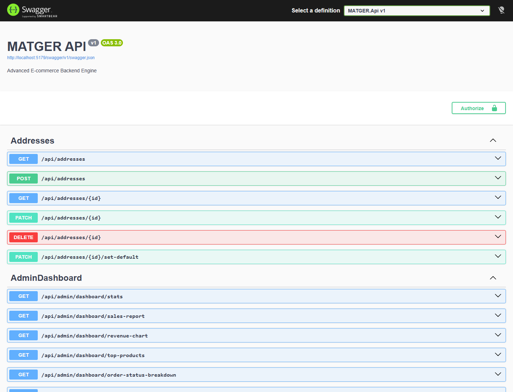
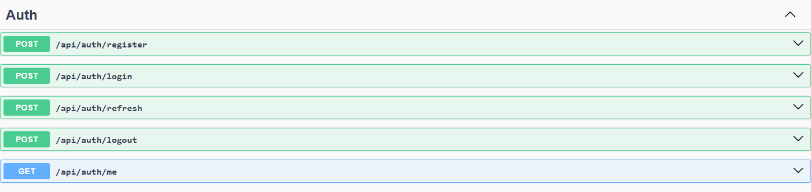
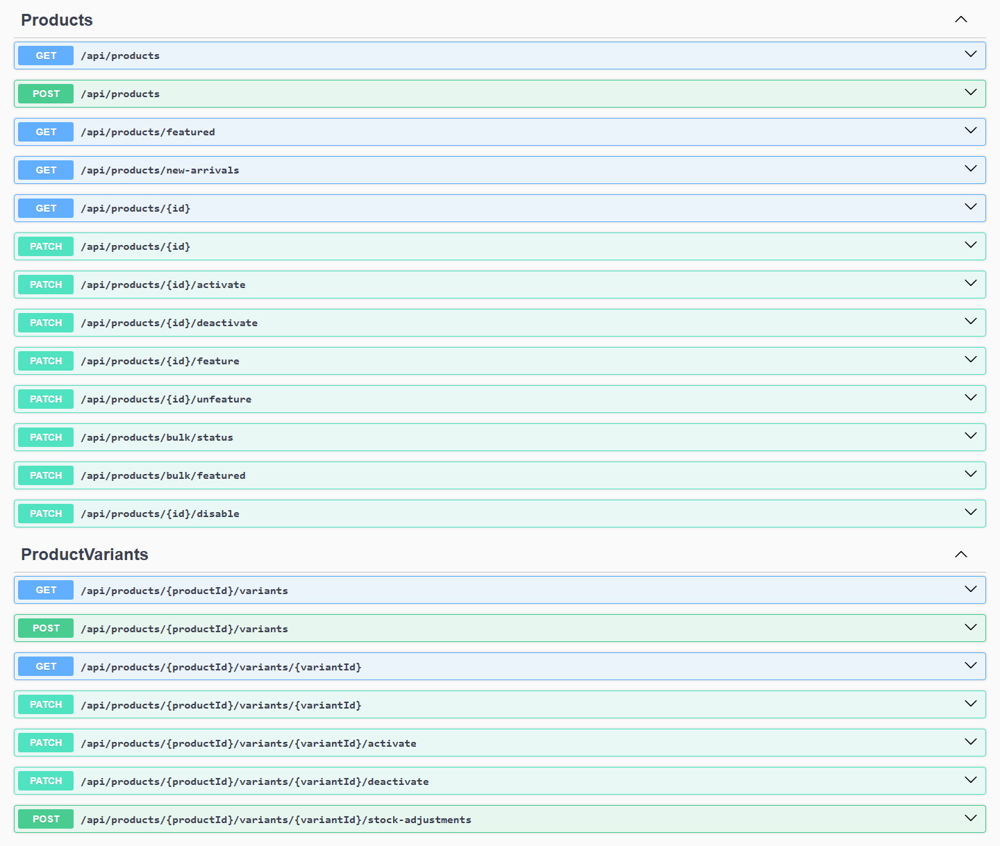
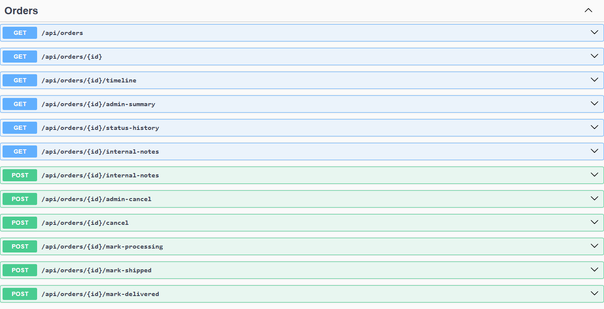
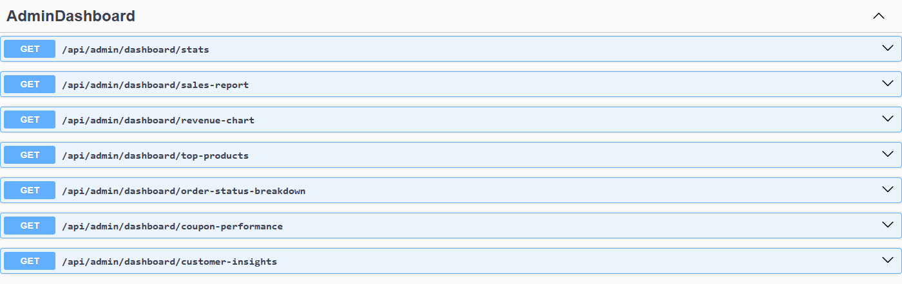
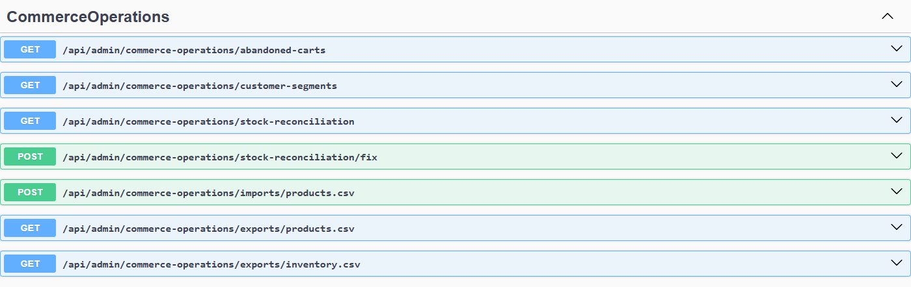
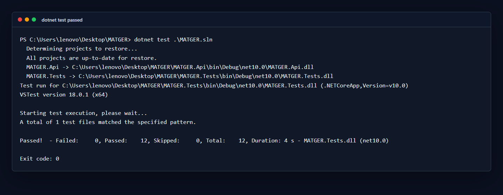
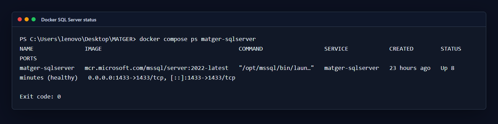
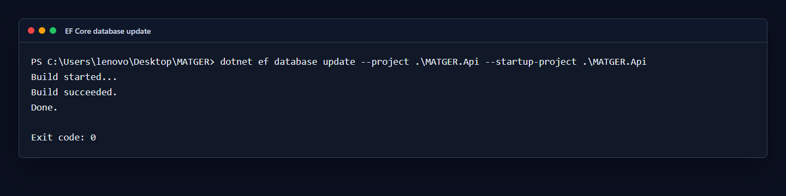

# MATGER — Advanced E-commerce Backend Engine

MATGER is a production-style ASP.NET Core Web API for an e-commerce backend. It keeps a simple two-project structure while covering the kinds of workflows reviewers expect to see in a serious backend portfolio: authentication, catalog management, carts, checkout, inventory, returns, refunds, reporting, Docker, CI, and integration tests.

## Why This Project Matters

This project demonstrates how a beginner-friendly .NET solution can still model real commerce behavior without becoming over-engineered. MATGER intentionally avoids Clean Architecture, MediatR, CQRS, payment providers, SMS, email, and frontend code. The focus is a readable API that handles authorization, state transitions, stock consistency, and testable business flows.

## Tech Stack

- ASP.NET Core Web API on .NET 10
- EF Core with SQL Server
- ASP.NET Core Identity
- JWT authentication and refresh tokens
- Swagger / Swashbuckle
- Serilog console and file logging
- Docker Compose for local SQL Server
- xUnit integration tests with WebApplicationFactory and SQLite
- GitHub Actions CI

## Current Architecture

The structure is intentionally small:

```text
MATGER/
  MATGER.Api/      ASP.NET Core API, EF Core DbContext, Identity, services, DTOs, controllers
  MATGER.Tests/    xUnit integration tests and test helpers
```

There are no extra application, domain, infrastructure, or frontend projects.

## Features

### Authentication & Authorization

- Customer registration, login, logout, refresh tokens, and current-user endpoint.
- Role-based policies for Admin, Customer, OrderManager, and InventoryManager.
- Admin-only protection for dashboards, reporting, audit logs, refunds, internal order notes, commerce operations, inventory intelligence, and checkout consistency tools.
- Customer ownership checks for carts, orders, addresses, returns, wishlist items, and reviews.

### Users / Roles

- ASP.NET Core Identity users with role seeding.
- Development-only admin seeding for local work.
- Strong password rules and unique email enforcement.

### Products & Categories

- Category CRUD and activation controls.
- Product CRUD, activation, featured products, new arrivals, bulk status changes, search, filtering, sorting, and pagination.
- Duplicate SKU protection across products and variants.
- Public catalog responses hide inactive products and inactive variants.

### Product Variants

- Variant CRUD under products.
- Variant SKU, price override, stock, low-stock threshold, active/inactive status, and stock adjustment support.
- Variant-aware cart, checkout, order items, inventory reservation, and review flows.

### Wishlist / Favorites

- Customer wishlist endpoints for adding, listing, and removing product favorites.

### Reviews & Moderation

- Customer product reviews with duplicate-review protection.
- Review visibility controls and admin moderation endpoints.
- Review creation requires an eligible delivered order.

### Cart

- Authenticated customer cart.
- Variant-aware cart items.
- Coupon application and removal.
- Stock validation when adding or updating items.

### Checkout

- Checkout from the authenticated cart.
- Address and shipping method validation.
- Mock payment attempts.
- Inventory reservation during checkout.
- Empty cart and insufficient stock failures are handled safely.
- Consistency checks protect against duplicate or stale checkout state.

### Mock Payments

- Payment confirmation and failure endpoints.
- Idempotency key support for payment confirmation.
- Paid, failed, and pending payment states.

### Coupons

- Admin coupon management.
- Coupon validation and redemption limits.
- Fixed and percentage discounts with usage limits.

### Orders

- Customer order listing and details.
- Customer cancellation where state rules allow it.
- Admin order summary, status history, internal notes, and admin cancellation.
- OrderManager fulfillment transitions for processing, shipped, and delivered states.

### Returns / Refunds

- Customer return requests for eligible delivered orders.
- Return policy window and quantity validation.
- Admin return approval, rejection, and completion.
- Admin-only refunds.
- Double refund and unpaid refund protection.

### Inventory

- Admin-only inventory listing, low-stock view, stock adjustment, and movement history.
- Inventory movement validation.
- Variant stock and product stock are kept distinct.

### Inventory Intelligence

- Admin-only inventory health summary.
- Needs-attention view.
- Top reserved product reporting.

### Stock Reconciliation

- Admin commerce operation endpoints for identifying and fixing stock inconsistencies.

### Shipping

- Public active shipping method list.
- Admin shipping method management.
- Admin-only order shipping updates.
- Shipping status updates are checked against order status.

### Admin Dashboard and Reporting

- Dashboard stats.
- Sales reports.
- Revenue chart data.
- Top products.
- Order status breakdown.
- Coupon performance.
- Customer insights.
- Customer segmentation.
- Abandoned cart reporting.

### CSV Import / Export

- Admin product CSV import.
- Product and inventory CSV exports.
- Import validation for malformed rows, required fields, duplicate SKUs, prices, stock values, booleans, categories, and return window values.

### Checkout Consistency

- Admin-only summary and issue endpoints.
- Protected maintenance endpoint for expiring pending payments.

### Security

- JWT bearer authentication.
- Role constants and policies are used consistently.
- Admin operations are protected with Admin-only policies.
- Customer routes enforce authenticated ownership.
- Concurrency conflicts return a 409 API error response.
- API error responses use the existing `ApiErrorResponse` shape where practical.

### Tests

- Integration tests run without SQL Server by using isolated SQLite databases.
- Coverage includes authorization, admin access, catalog visibility, variant SKUs, cart, checkout, stock failures, order ownership, order transitions, returns, refunds, reviews, inventory, admin reporting, and checkout consistency.

### Docker

- Dockerfile builds the existing two-project solution and publishes `MATGER.Api`.
- Docker Compose provides a local SQL Server container for development.

### CI

- GitHub Actions restores, builds, and tests the solution on every push and pull request.

## How To Run Locally

Prerequisites:

- .NET 10 SDK
- Docker Desktop or another Docker runtime
- EF Core CLI tool

Start SQL Server:

```powershell
Copy-Item .env.example .env
docker compose up -d matger-sqlserver
```

Apply EF Core migrations:

```powershell
dotnet ef database update --project .\MATGER.Api --startup-project .\MATGER.Api
```

Run the API:

```powershell
dotnet run --project .\MATGER.Api
```

Swagger is available in Development at:

```text
https://localhost:5001/swagger
http://localhost:5000/swagger
```

The exact ports can vary by launch profile. Check `MATGER.Api/Properties/launchSettings.json` if needed.

## Docker Setup

The included Compose file starts SQL Server:

```powershell
docker compose up -d
```

The API Docker image can be built with:

```powershell
docker build -t matger-api .
```

The API does not automatically apply migrations at startup. Apply migrations before running against a new SQL Server database.

## Configuration

`appsettings.json` contains development-safe defaults only. For real deployments, override these values through environment variables or secret storage:

- `ConnectionStrings__DefaultConnection`
- `Jwt__Issuer`
- `Jwt__Audience`
- `Jwt__SecretKey`
- `Jwt__AccessTokenExpirationMinutes`

`.env.example` is safe to commit and is used as a local template. `.env` is ignored by Git.

## EF Core Commands

Create a migration:

```powershell
dotnet ef migrations add MigrationName --project .\MATGER.Api --startup-project .\MATGER.Api
```

Apply migrations:

```powershell
dotnet ef database update --project .\MATGER.Api --startup-project .\MATGER.Api
```

Drop the local database when you want a clean start:

```powershell
dotnet ef database drop --project .\MATGER.Api --startup-project .\MATGER.Api --force
```

## Build And Test

```powershell
dotnet restore .\MATGER.sln
dotnet build .\MATGER.sln
dotnet test .\MATGER.sln
```

## GitHub Actions CI

The workflow at `.github/workflows/ci.yml` runs on pushes, pull requests, and manual dispatch. It restores the solution, builds it in Release configuration, and runs the xUnit integration test suite.

## Default Roles And Local Seeding

The API seeds these roles at startup:

- `Admin`
- `Customer`
- `OrderManager`
- `InventoryManager`

In Development only, the API seeds an admin user:

```text
Email: admin@matger.local
Password: Admin12345
```

Use this only for local development. Do not expose a Development environment publicly.

## Important Endpoints Overview

- Auth: `POST /api/auth/register`, `POST /api/auth/login`, `POST /api/auth/refresh`, `POST /api/auth/logout`, `GET /api/auth/me`
- Products: `GET /api/products`, `GET /api/products/featured`, `POST /api/products`, `PATCH /api/products/{id}`
- Variants: `GET /api/products/{productId}/variants`, `POST /api/products/{productId}/variants`, `PATCH /api/products/{productId}/variants/{variantId}`
- Cart: `GET /api/cart`, `POST /api/cart/items`, `PATCH /api/cart/items/{itemId}`, `POST /api/cart/coupon`
- Checkout: `POST /api/checkout/start`, `POST /api/checkout/confirm-payment`, `POST /api/checkout/fail-payment`
- Orders: `GET /api/orders`, `GET /api/orders/{id}`, `POST /api/orders/{id}/cancel`, `POST /api/orders/{id}/mark-shipped`
- Returns: `POST /api/orders/{orderId}/returns`, `GET /api/orders/{orderId}/returns`, `GET /api/returns`
- Refunds: `POST /api/orders/{orderId}/refund`, `GET /api/refunds`
- Reviews: `GET /api/products/{productId}/reviews`, `POST /api/products/{productId}/reviews`, `GET /api/admin/product-reviews`
- Inventory: `GET /api/inventory`, `GET /api/inventory/low-stock`, `POST /api/inventory/{productId}/adjust`
- Admin dashboard: `GET /api/admin/dashboard/stats`, `GET /api/admin/dashboard/sales-report`, `GET /api/admin/dashboard/revenue-chart`
- Commerce operations: `GET /api/admin/commerce-operations/stock-reconciliation`, `POST /api/admin/commerce-operations/imports/products.csv`
- Checkout consistency: `GET /api/admin/checkout-consistency/summary`, `GET /api/admin/checkout-consistency/issues`

## Screenshots

Capture the real screenshots manually after the API, SQL Server container, and Swagger are running. Save each image under `docs/screenshots/` using the exact filenames below.



















See `docs/screenshots/README.md` for the screenshot capture checklist.

## GitHub Final Checklist

Before pushing the final repository, run:

```powershell
dotnet build .\MATGER.sln
dotnet test .\MATGER.sln
docker compose up -d matger-sqlserver
dotnet ef database update --project .\MATGER.Api --startup-project .\MATGER.Api
dotnet run --project .\MATGER.Api
```

See `docs/GITHUB_CHECKLIST.md` for the publish checklist.

## Postman Collection

No Postman collection is currently included. Swagger is the primary API exploration surface.

## Future Improvements

- Add a Postman collection or HTTP file for common flows.
- Add rate limiting for authentication endpoints.
- Add refresh-token rotation tests around suspicious reuse scenarios.
- Add richer reporting export formats.
- Add Docker Compose API profile once database migration orchestration is intentionally designed.

## Portfolio Value

MATGER shows a reviewer that you can build more than CRUD. It demonstrates API design, EF Core modeling, Identity, JWT security, role-based authorization, order and inventory state rules, CSV handling, Docker-based local infrastructure, CI, and meaningful integration tests while keeping the codebase understandable.
